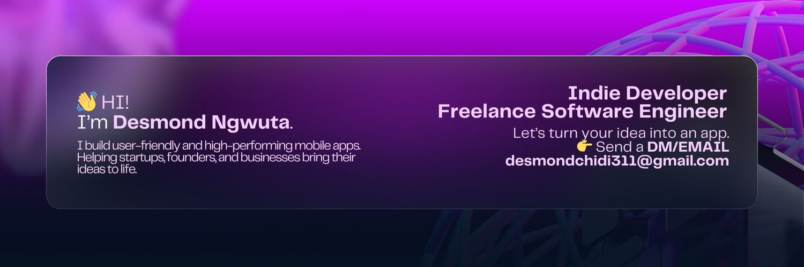

I’m a software engineer with 4+ years of experience helping **startups, founders, and businesses** bring their ideas to life through **mobile and web applications**.  

I specialize in:  
- **Cross-platform apps** with Flutter  
- **Native Android** (Kotlin/Java) and **iOS** (Swift, UIKit, SwiftUI)  
- **Fullstack development** with Java Spring Boot & REST APIs  

I’ve collaborated with:  
- **NUBiA Mega Tech** – building scalable cross-platform mobile apps  
- **Jamit** – launching production-grade Android apps
- **PreDiagn** – developing a health diagnostics app powered by ML  
- Multiple **founders and global clients** on freelance projects in health tech, productivity, and on-demand services  

📫 **Let’s build something together:** desmondchidi311@gmail.com  
🔗 [LinkedIn](https://linkedin.com/in/ngwuta)  
