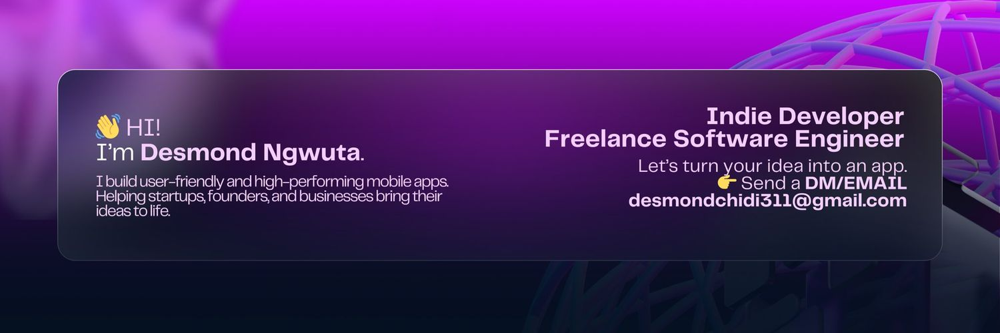

I’m a software engineer with **5+ years of experience** helping **startups, founders, and businesses** bring their ideas to life through **mobile and web applications**.

### What I’m currently working on
- **Maintaining and improving the Pgold Pro App** — introducing new features that make transacting **easy, secure, and reliable**
- **Helping Merchrix bring its ideas to life** — one commit at a time

### What I specialize in
- **Cross-platform apps** with Flutter  
- **Native Android** (Kotlin/Java) and **iOS** (Swift, UIKit, SwiftUI)  
- **Fullstack development** with Java Spring Boot & REST APIs  

### Experience
I’ve collaborated with:
- **NUBiA Mega Tech** – building scalable cross-platform mobile apps  
- **Jamit** – launching production-grade Android apps  
- **PreDiagn** – developing a health diagnostics app powered by ML  
- Multiple **founders and global clients** on freelance projects in health tech, productivity, and on-demand services  

### Let’s build something together
📫 **Email:** desmondchidi311@gmail.com  
🔗 **LinkedIn:** https://linkedin.com/in/ngwuta  
